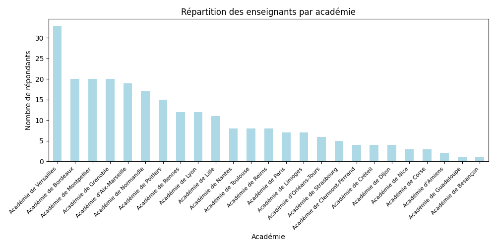
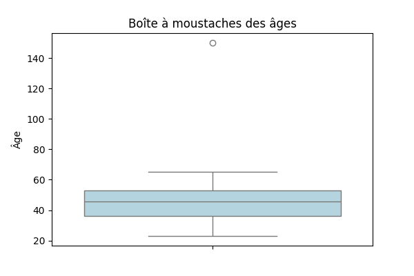
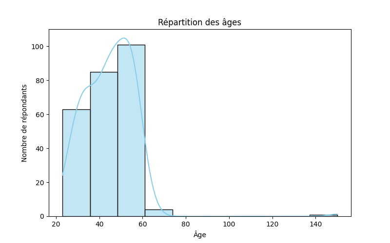
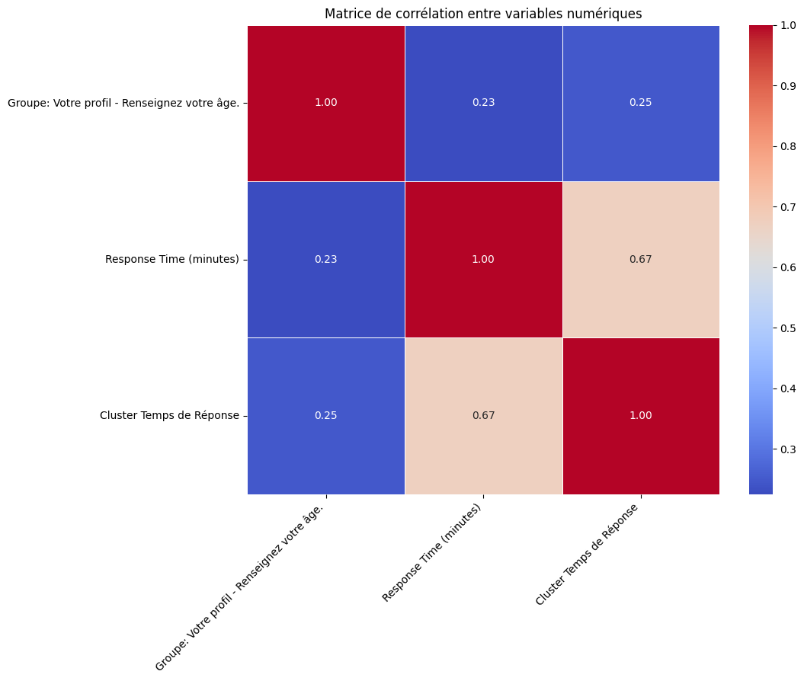
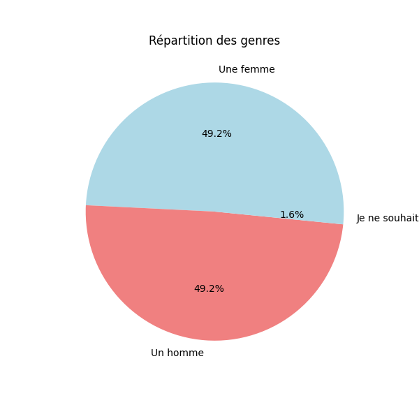
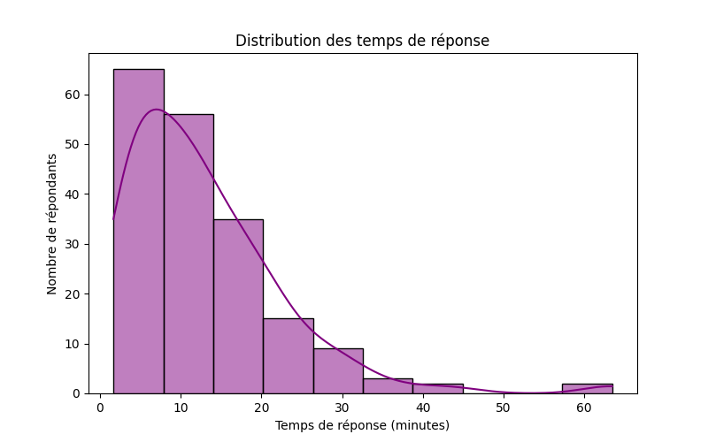
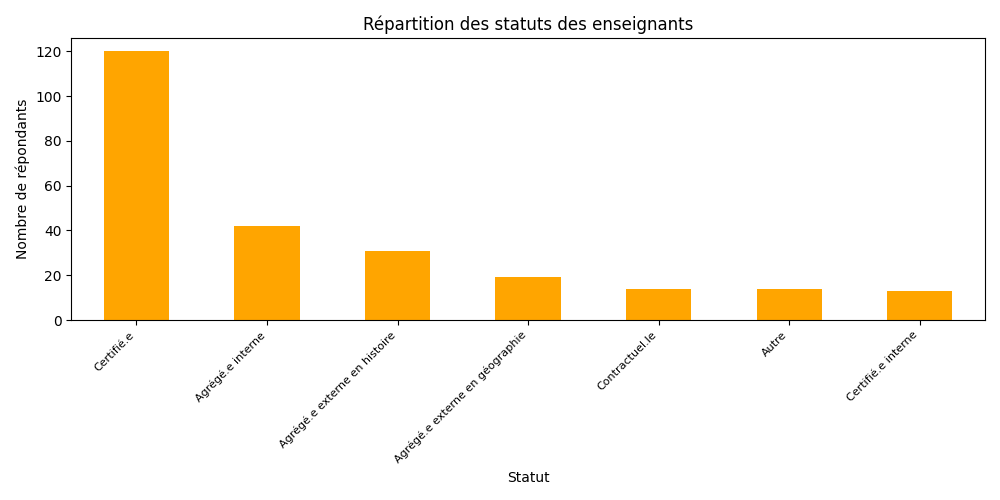

# Analyse de Données sur un Fichier HTML

Ce projet analyse un fichier HTML contenant des réponses à un questionnaire et génère des statistiques détaillées sous forme de graphiques et d'un rapport PDF.

##  Fonctionnalités
- Extraction et parsing du fichier HTML
- Calcul de statistiques classiques et avancées
- Génération de graphiques de visualisation
- Export des résultats en fichier Excel et PDF

##  Structure du projet
```
📁 data-analysis-on-an-HTML-file
│-- main.py          # Programme principal
│-- parser.py        # Extraction des données depuis le HTML
│-- stats.py         # Calcul des statistiques de base
│-- advanced_stats.py # Calcul des statistiques avancées
│-- export.py        # Export des résultats en Excel et PDF
│-- graphs/          # Dossier contenant les graphiques générés
│-- output/          # Dossier contenant les fichiers exportés
│   ├── report.pdf   # Rapport PDF généré
```

##  Installation
### 1 Cloner le dépôt
```bash
git clone https://github.com/votre-repo/data-analysis-on-an-HTML-file.git
cd data-analysis-on-an-HTML-file
```
### 2 Installer les dépendances
```bash
pip install -r requirements.txt
```

##  Dépendances
Le projet utilise les bibliothèques suivantes :
```
pandas
numpy
matplotlib
seaborn
scipy
plotly
beautifulsoup4
fpdf
```

##   Utilisation
Exécuter le script principal en fournissant le fichier HTML d'entrée et les fichiers de sortie :
```bash
python main.py input.html output.xlsx --output_pdf output/report.pdf
```
## 📊 Visualisations

### 📌 Répartition par académie  


### 📌 Boxplot de l'âge  


### 📌 Répartition des âges  


### 📌 Matrice de corrélation  


### 📌 Répartition par genre  


### 📌 Répartition des temps de réponse  


### 📌 Répartition des statuts  


##   Rapport Généré

Le rapport généré est disponible ici : [report.pdf](report.pdf)

##   Auteur
Fayssal Zakaria
